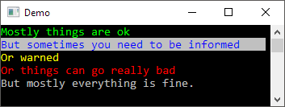

## Used the build in styles to add some color to your console

Doint this
```c#
console
	.Style(StyleName.Ok)
	.WriteLine("Mostly things are ok")
	.Style(StyleName.Info)
	.WriteLine("But sometimes you need to be informed")
	.Style(StyleName.Warning)
	.WriteLine("Or warned")
	.Style(StyleName.Error)
	.WriteLine("Or things can go really bad")
	.ResetStyle()
	.WriteLine("But mostly everything is fine.");
```

Will give you something like this

